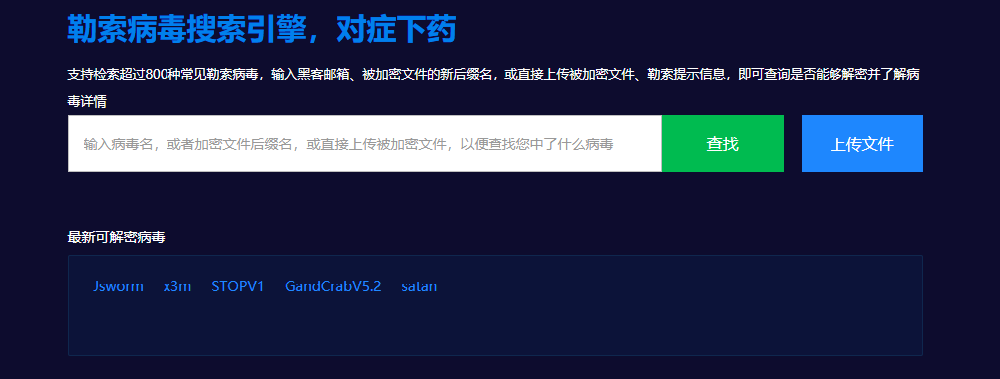

## 第5篇：勒索病毒自救指南

### 前言

经常会有一些小伙伴问：中了勒索病毒，该怎么办，可以解密吗？

第一次遇到勒索病毒是在早几年的时候，客户因网站访问异常，进而远程协助进行排查。登录服务器，在站点目录下发现所有的脚本文件及附件后缀名被篡改，每个文件夹下都有一个文件打开后显示勒索提示信息，这便是勒索病毒的特征。

出于职业习惯，我打包了部分加密文件样本和勒索病毒提示信息用于留档，就在今天，我又重新上传了样本，至今依然无法解密。

作为一个安全工程师，而非一个专业的病毒分析师，我们可以借助各大安全公司的能力，寻找勒索病毒的解密工具。

本文整理了一份勒索病毒自救指南，通过勒索病毒索引引擎查找勒索病毒相关信息，再通过各个安全公司提供的免费勒索软件解密工具解密。当然，能否解密全凭运气，so，平时还是勤打补丁多备份。

**一、勒索病毒搜索引擎**

在勒索病毒搜索引擎输入病毒名、勒索邮箱、被加密后文件的后缀名，或直接上传被加密文件、勒索提示信息，即可可快速查找到病毒详情和解密工具。

这些网站的解密能力还在持续更新中，是值得收藏的几个勒索病毒工具型网站。

【360】 勒索病毒搜索引擎，支持检索超过800种常见勒索病毒

官网：http://lesuobingdu.360.cn

【腾讯】 勒索病毒搜索引擎，支持检索超过 300 种常见勒索病毒

官网：https://guanjia.qq.com/pr/ls

【启明】VenusEye勒索病毒搜索引擎，超300种勒索病毒家族

官网：https://lesuo.venuseye.com.cn

【奇安信】勒索病毒搜索引擎

官网：https://lesuobingdu.qianxin.com

【深信服】勒索病毒搜索引擎

官网：https://edr.sangfor.com.cn/#/information/ransom_search

------

**二、勒索软件解密工具集**

很多安全公司都提供了免费的勒索病毒解密工具下载，收集和整理相关下载地址，可以帮助我们了解和获取最新的勒索病毒解密工具。

【腾讯哈勃】勒索软件专杀工具

官网：https://habo.qq.com/tool

【金山毒霸】勒索病毒免疫工具

官网：http://www.duba.net/dbt/wannacry.html

【火绒】安全工具下载

官网：http://bbs.huorong.cn/forum-55-1.html

【瑞星】解密工具下载

官网：http://it.rising.com.cn/fanglesuo/index.html

【nomoreransom】勒索软件解密工具集

官网：https://www.nomoreransom.org/zh/index.html

【MalwareHunterTeam】勒索软件解密工具集

官网：https://id-ransomware.malwarehunterteam.com

【卡巴斯基】免费勒索解密器

官网：https://noransom.kaspersky.com

【Avast】免费勒索软件解密工具

官网：https://www.avast.com/zh-cn/ransomware-decryption-tools

【Emsisoft】免费勒索软件解密工具

官网：https://www.emsisoft.com/ransomware-decryption-tools/free-download

【GitHub 项目】勒索病毒解密工具收集汇总

官网：https://github.com/jiansiting/Decryption-Tools