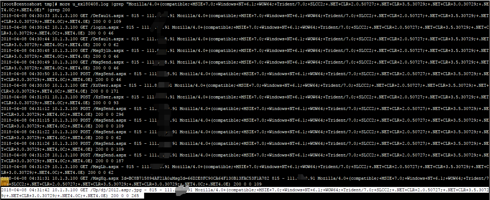

## 第3篇:Web日志分析

### ox01  Web日志

Web访问日志记录了Web服务器接收处理请求及运行时错误等各种原始信息。通过对WEB日志进行的安全分析，不仅可以帮助我们定位攻击者，还可以帮助我们还原攻击路径，找到网站存在的安全漏洞并进行修复。

我们来看一条Apache的访问日志：

`127.0.0.1 - - [11/Jun/2018:12:47:22 +0800] "GET /login.html HTTP/1.1" 200 786 "-" "Mozilla/5.0 (Windows NT 10.0; WOW64) AppleWebKit/537.36 (KHTML, like Gecko) Chrome/66.0.3359.139 Safari/537.36"`

通过这条Web访问日志，我们可以清楚的得知用户在什么IP、什么时间、用什么操作系统、什么浏览器的情况下访问了你网站的哪个页面，是否访问成功。

本文通过介绍Web日志安全分析时的思路和常用的一些技巧。

### 0x02 日志分析技巧

在对WEB日志进行安全分析时，一般可以按照两种思路展开，逐步深入，还原整个攻击过程。

第一种：确定入侵的时间范围，以此为线索，查找这个时间范围内可疑的日志，进一步排查，最终确定攻击者，还原攻击过程。

第二种：攻击者在入侵网站后，通常会留下后门维持权限，以方便再次访问，我们可以找到该文件，并以此为线索来展开分析。

常用分析工具：

Window下，推荐用 EmEditor 进行日志分析，支持大文本，搜索效率还不错。

Linux下，使用Shell命令组合查询分析。

Shell+Linux命令实现日志分析，一般结合grep、awk等命令等实现了几个常用的日志分析统计技巧。

Apache日志分析技巧：

~~~
1、列出当天访问次数最多的IP命令：
cut -d- -f 1 log_file|uniq -c | sort -rn | head -20

2、查看当天有多少个IP访问：
awk '{print $1}' log_file|sort|uniq|wc -l

3、查看某一个页面被访问的次数：
grep "/index.php" log_file | wc -l

4、查看每一个IP访问了多少个页面：
awk '{++S[$1]} END {for (a in S) print a,S[a]}' log_file

5、将每个IP访问的页面数进行从小到大排序：
awk '{++S[$1]} END {for (a in S) print S[a],a}' log_file | sort -n

6、查看某一个IP访问了哪些页面：
grep ^111.111.111.111 log_file| awk '{print $1,$7}'

7、去掉搜索引擎统计当天的页面：
awk '{print $12,$1}' log_file | grep ^\"Mozilla | awk '{print $2}' |sort | uniq | wc -l

8、查看2018年6月21日14时这一个小时内有多少IP访问:
awk '{print $4,$1}' log_file | grep 21/Jun/2018:14 | awk '{print $2}'| sort | uniq | wc -l	
~~~

### 0x03 日志分析案例

Web日志分析实例：通过nginx代理转发到内网某服务器，内网服务器某站点目录下被上传了多个图片木马，虽然II7下不能解析，但还是想找出谁通过什么路径上传的。

在这里，我们遇到了一个问题：由于设置了代理转发，只记录了代理服务器的ip，并没有记录访问者IP？这时候，如何去识别不同的访问者和攻击源呢？

这是管理员日志配置不当的问题，但好在我们可以通过浏览器指纹来定位不同的访问来源，还原攻击路径。

1、定位攻击源

首先访问图片木马的记录，只找到了一条，由于所有访问日志只记录了代理IP，并不能通过IP来还原攻击路径，这时候，可以利用浏览器指纹来定位。


浏览器指纹：

`Mozilla/4.0+(compatible;+MSIE+7.0;+Windows+NT+6.1;+WOW64;+Trident/7.0;+SLCC2;+.NET+CLR+2.0.50727;+.NET+CLR+3.5.30729;+.NET+CLR+3.0.30729;+.NET4.0C;+.NET4.0E)`

2、搜索相关日志记录

通过筛选与该浏览器指纹有关的日志记录，可以清晰地看到攻击者的攻击路径。



3、对找到的访问日志进行解读，攻击者大致的访问路径如下：

~~~
A、攻击者访问首页和登录页
B、攻击者访问MsgSjlb.aspx和MsgSebd.aspx
C、攻击者访问Xzuser.aspx
D、攻击者多次POST（怀疑通过这个页面上传模块缺陷）
E、攻击者访问了图片木马
~~~

打开网站，访问Xzuser.aspx，确认攻击者通过该页面的进行文件上传了图片木马，同时，发现网站了存在越权访问漏洞，攻击者访问特定URL，无需登录即可进入后台界面。通过日志分析找到网站的漏洞位置并进行修复。

### 0x04 日志统计分析技巧		

统计爬虫：

```javascript
grep -E 'Googlebot|Baiduspider'  /www/logs/access.2019-02-23.log | awk '{ print $1 }' | sort | uniq
```

统计浏览器：

```javascript
cat /www/logs/access.2019-02-23.log | grep -v -E 'MSIE|Firefox|Chrome|Opera|Safari|Gecko|Maxthon' | sort | uniq -c | sort -r -n | head -n 100		
```

IP 统计：

```javascript
grep '23/May/2019' /www/logs/access.2019-02-23.log | awk '{print $1}' | awk -F'.' '{print $1"."$2"."$3"."$4}' | sort | uniq -c | sort -r -n | head -n 10
   2206 219.136.134.13
   1497 182.34.15.248
   1431 211.140.143.100
   1431 119.145.149.106
   1427 61.183.15.179
   1427 218.6.8.189
   1422 124.232.150.171
   1421 106.187.47.224
   1420 61.160.220.252
   1418 114.80.201.18			
```

统计网段：

```javascript
cat /www/logs/access.2019-02-23.log | awk '{print $1}' | awk -F'.' '{print $1"."$2"."$3".0"}' | sort | uniq -c | sort -r -n | head -n 200			
```

统计域名：

```javascript
cat  /www/logs/access.2019-02-23.log |awk '{print $2}'|sort|uniq -c|sort -rn|more		
```

HTTP Status：

```javascript
cat  /www/logs/access.2019-02-23.log |awk '{print $9}'|sort|uniq -c|sort -rn|more
5056585 304
1125579 200
   7602 400
      5 301	
```

URL 统计：

```javascript
cat  /www/logs/access.2019-02-23.log |awk '{print $7}'|sort|uniq -c|sort -rn|more			
```

文件流量统计：

```javascript
cat /www/logs/access.2019-02-23.log |awk '{sum[$7]+=$10}END{for(i in sum){print sum[i],i}}'|sort -rn|more

grep ' 200 ' /www/logs/access.2019-02-23.log |awk '{sum[$7]+=$10}END{for(i in sum){print sum[i],i}}'|sort -rn|more			
```

URL访问量统计：

```javascript
cat /www/logs/access.2019-02-23.log | awk '{print $7}' | egrep '\?|&' | sort | uniq -c | sort -rn | more			
```

脚本运行速度：

查出运行速度最慢的脚本

```javascript
grep -v 0$ /www/logs/access.2019-02-23.log | awk -F '\" ' '{print $4" " $1}' web.log | awk '{print $1" "$8}' | sort -n -k 1 -r | uniq > /tmp/slow_url.txt			
```

IP, URL 抽取：

```javascript
# tail -f /www/logs/access.2019-02-23.log | grep '/test.html' | awk '{print $1" "$7}'			
```

