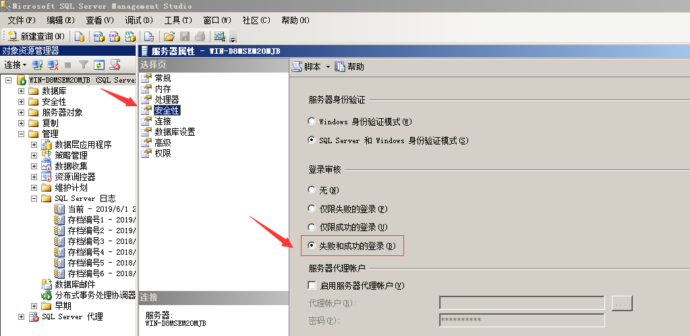
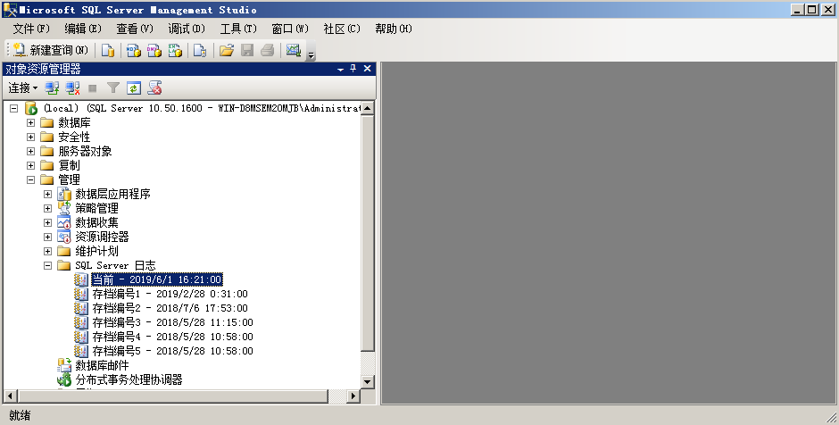
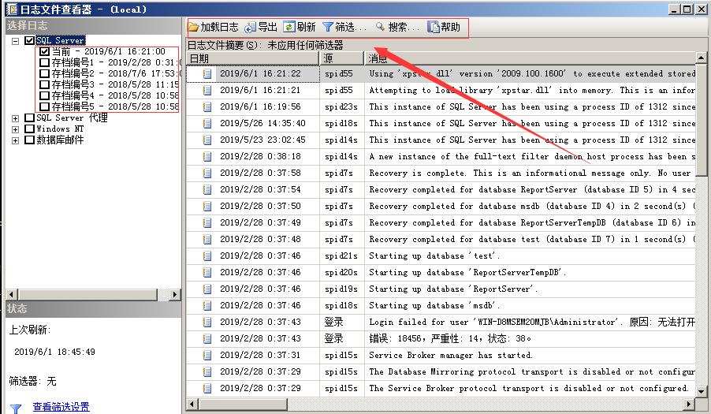
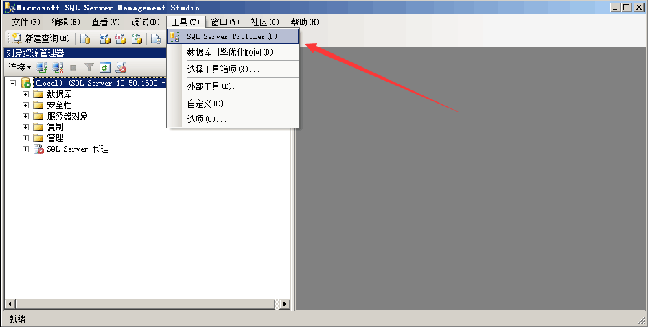
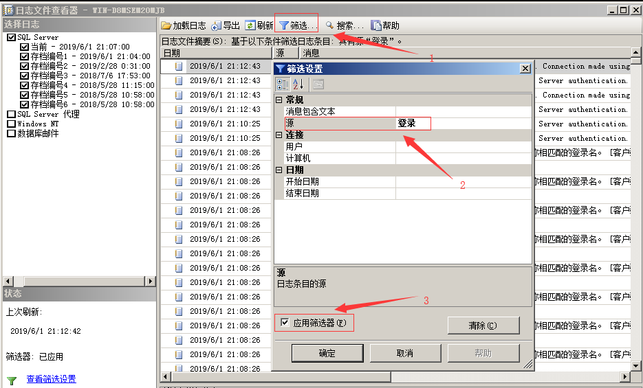
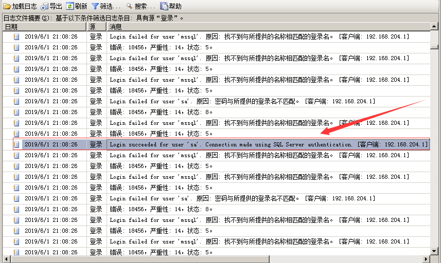

## 第4篇:MSSQL日志分析

常见的数据库攻击包括弱口令、SQL注入、提升权限、窃取备份等。对数据库日志进行分析，可以发现攻击行为，进一步还原攻击场景及追溯攻击源。

### 0x01 MSSQL日志分析

首先，MSSQL数据库应启用日志记录功能，默认配置仅限失败的登录，需修改为失败和成功的登录，这样就可以对用户登录进行审核。

登录到SQL Server Management Studio，依次点击 管理--SQL Server 日志

双击日志存档文件即可打开日志文件查看器，并可以对日志进行筛选或者导出等操作。

另外，MSSQ提供了一个工具SQL Server Profiler ，方便查找和发现SQL执行的效率和语句问题。

日志分析案例：

在日志文件查看器中，选择筛选，在筛选设置中源设置为“登录”，应用筛选器，确定。

筛选后的结果，可以很清晰的识别用户登录信息，记录内容包括用户登录时间、登录是否成功、登录使用的账号以及远程登录时用户使用的IP地址。

如下图：客户端：192.168.204.1进行尝试弱口令登录，并发现其中有一条登录成功的记录。

### 0x02  SQL注入入侵痕迹

在利用SQL注入漏洞的过程中，我们会尝试利用sqlmap的--os-shell参数取得shell，如操作不慎，可能留下一些sqlmap创建的临时表和自定义函数。我们先来看一下sqlmap os-shell参数的用法以及原理：

1、构造一个SQL注入点，开启Burp监听8080端口

`sqlmap.py  -u http://192.168.204.164/sql.asp?id=1 --os-shell --proxy=http://127.0.0.1:8080`

HTTP通讯过程如下：

创建了一个临时表sqlmapoutput，调用存储过程执行系统命令将数据写入临时表，然后取临时表中的数据展示到前端。

通过查看数据库中最近新建的表的结构和内容，可以判断是否发生过sql注入漏洞攻击事件。

检查方法：

1、数据库表检查

2、检查xp_cmdshell等存储过程

xp_cmdshell在mssql2005之后的版本中是默认禁止的，查看xp_cmdshell是否被启用。

`Exec master.dbo.xp_cmdshell 'whoami'

3、需要结合web日志，通过查看日志文件的大小以及审计日志文件中的内容，可以判断是否发生过sql注入漏洞攻击事件。
