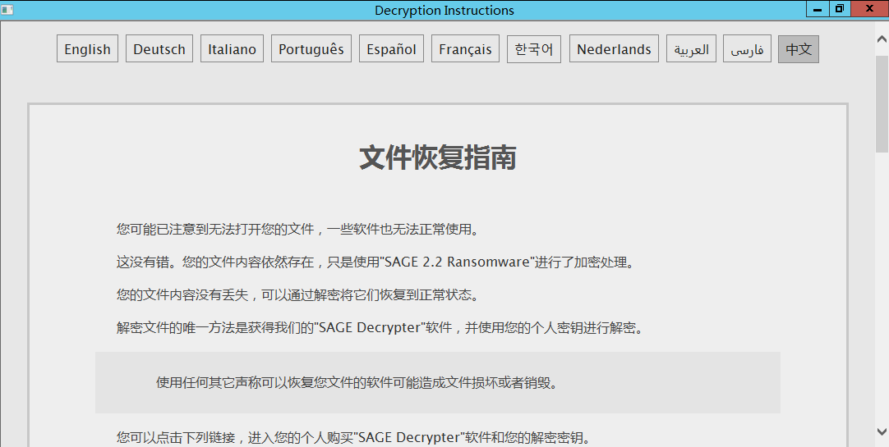

## 第3篇：勒索病毒

### 0x00 前言

​	勒索病毒，是一种新型电脑病毒，主要以邮件、程序木马、网页挂马的形式进行传播。该病毒性质恶劣、危害极大，一旦感染将给用户带来无法估量的损失。这种病毒利用各种加密算法对文件进行加密，被感染者一般无法解密，必须拿到解密的私钥才有可能破解。自WannaCry勒索病毒在全球爆发之后，各种变种及新型勒索病毒层出不穷。

### 0x01 应急场景

​	某天早上，网站管理员打开OA系统，首页访问异常，显示乱码：


### 0x02 事件分析

​	登录网站服务器进行排查，在站点目录下发现所有的脚本文件及附件都被加密为.sage结尾的文件，每个文件夹下都有一个!HELP_SOS.hta文件，打包了部分样本：


打开!HELP_SOS.hta文件，显示如下： 



到这里，基本可以确认是服务器中了勒索病毒，上传样本到360勒索病毒网站（http://lesuobingdu.360.cn）进行分析：确认web服务器中了sage勒索病毒，目前暂时无法解密。


绝大多数勒索病毒，是无法解密的，一旦被加密，即使支付也不一定能够获得解密密钥。在平时运维中应积极做好备份工作，数据库与源码分离（类似OA系统附件资源也很重要，也要备份）。 

遇到了，别急，试一试勒索病毒解密工具：

```
“拒绝勒索软件”网站
https://www.nomoreransom.org/zh/index.html
360安全卫士勒索病毒专题
http://lesuobingdu.360.cn
```

### 0x04 防范措施

​	一旦中了勒索病毒，文件会被锁死，没有办法正常访问了，这时候，会给你带来极大的困恼。为了防范这样的事情出现，我们电脑上要先做好一些措施：

```
1、安装杀毒软件，保持监控开启，定期全盘扫描
2、及时更新 Windows安全补丁，开启防火墙临时关闭端口，如445、135、137、138、139、3389等端口
3、及时更新web漏洞补丁，升级web组件
4、备份。重要的资料一定要备份，谨防资料丢失
5、强化网络安全意识，陌生链接不点击，陌生文件不要下载，陌生邮件不要打开
```

