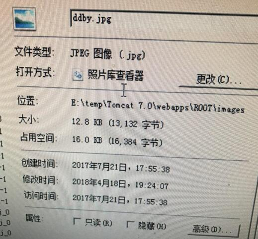
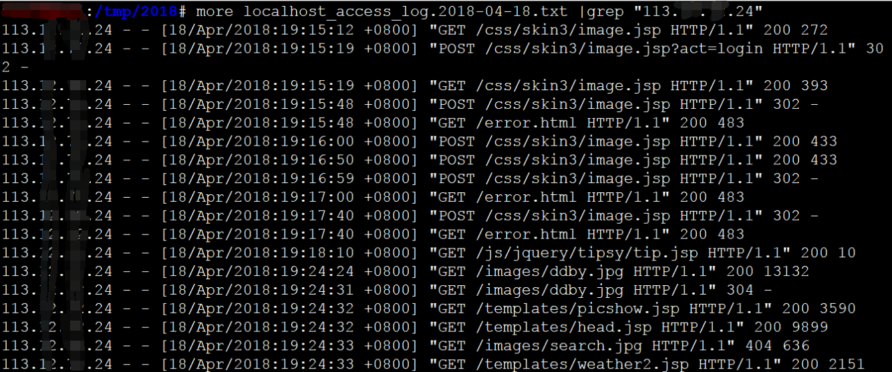
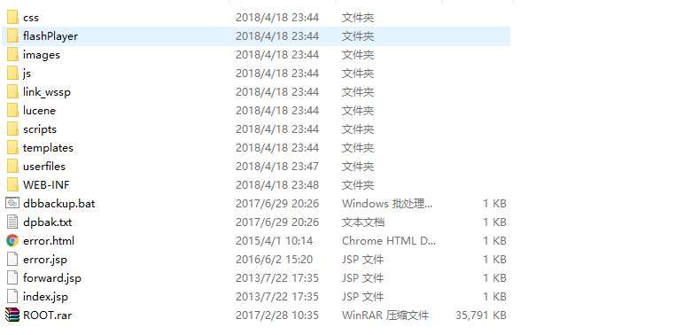
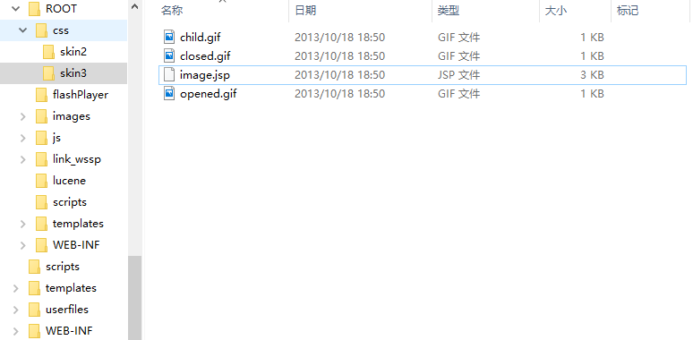

## 第7篇：网站首页被篡改

​	网站首页被非法篡改，是的，就是你一打开网站就知道自己的网站出现了安全问题，网站程序存在严重的安全漏洞，攻击者通过上传脚本木马，从而对网站内容进行篡改。而这种篡改事件在某些场景下，会被无限放大。

### 现象描述

网站首页被恶意篡改，比如复制原来的图片，PS一下，然后替换上去。

### 问题处理

1、**确认篡改时间**

通过对被篡改的图片进行查看，确认图片篡改时间为2018年04月18日 19:24:07 。

**2、访问日志溯源**

通过图片修改的时间节点，发现可疑IP：113.xx.xx.24 （代理IP，无法追溯真实来源），访问image.jsp（脚本木马），并随后访问了被篡改的图片地址。

进一步审查所有的日志文件(日志保存时间从2017-04-20至2018-04-19)，发现一共只有两次访问image.jsp文件的记录，分别是2018-04-18和2017-09-21。

image.jsp在2017-09-21之前就已经上传到网站服务器，已经潜藏长达半年多甚至更久的时间。

**3、寻找真相**

我们在网站根目录找到了答案，发现站点目录下存在ROOT.rar全站源码备份文件，备份时间为2017-02-28
10:35。

通过对ROOT.rar解压缩，发现源码中存在的脚本木马与网站访问日志的可疑文件名一致（image.jsp）。

根据这几个时间节点，我们尝试去还原攻击者的攻击路径。

但是我们在访问日志并未找到ROOT.rar的访问下载记录，访问日志只保留了近一年的记录，而这个webshell可能已经存在了多年。

黑客是如何获取webshell的呢？

可能是通过下载ROOT.rar全站源码备份文件获取到其中存在的木马信息，或者几年前入侵并潜藏了多年，又或者是从地下黑产购买了shell，我们不得而知。

本文的示例中攻击者为我们留下了大量的证据和记录，而更多时候，攻击者可能会清除所有的关键信息，这势必会加大调查人员的取证难度。

