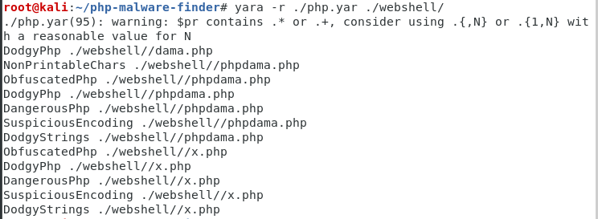

当网站服务器被入侵时，我们需要一款Webshell检测工具，来帮助我们发现webshell，进一步排查系统可能存在的安全漏洞。

本文推荐了10款Webshll检测工具，用于网站入侵排查。当然，目前市场上的很多主机安全产品也都提供这种WebShell检测能力，比如阿里云、青藤云、safedog等，本文暂不讨论。

------

**1、D盾_Web查杀**

阿D出品，使用自行研发不分扩展名的代码分析引擎，能分析更为隐藏的WebShell后门行为。

兼容性：只提供Windows版本。

工具下载地址：http://www.d99net.net/down/WebShellKill_V2.0.9.zip

**2、百度WEBDIR+**

下一代WebShell检测引擎，采用先进的动态监测技术，结合多种引擎零规则查杀。

兼容性：提供在线查杀木马，免费开放API支持批量检测。

在线查杀地址：https://scanner.baidu.com/

**3、河马**

专注webshell查杀研究，拥有海量webshell样本和自主查杀技术，采用传统特征+云端大数据双引擎的查杀技术。查杀速度快、精度高、误报低。

兼容性：支持Windows、linux，支持在线查杀。

官方网站：https://www.shellpub.com/

**4、Web Shell Detector**

Webshell Detector具有“ Webshell”签名数据库，可帮助识别高达99％的“ Webshell”。

兼容性：提供php/python脚本，可跨平台，在线检测。

官方网站：http://www.shelldetector.com/

github项目地址：https://github.com/emposha/PHP-Shell-Detector

**5、CloudWalker（牧云）**

一个可执行的命令行版本 Webshell 检测工具。目前，项目已停止更新。

兼容性，提供linux版本，Windows 暂不支持。

在线查杀demo：<https://webshellchop.chaitin.cn/>

github项目地址：https://github.com/chaitin/cloudwalker

**6、Sangfor WebShellKill**

Sangfor WebShellKill(网站后门检测工具)是一款web后门专杀工具，不仅支持webshell的扫描，同时还支持暗链的扫描。是一款融合了多重检测引擎的查杀工具。能更精准地检测出WEB网站已知和未知的后门文件。

兼容性：支持Windows、linux

工具下载地址：http://edr.sangfor.com.cn/backdoor_detection.html（已停止访问）

**7、深度学习模型检测PHP Webshell**

一个深度学习PHP webshell查杀引擎demo，提供在线样本检测。

在线查杀地址：http://webshell.cdxy.me/

**8、PHP Malware Finder**

PHP-malware-finder 是一款优秀的检测webshell和恶意软件混淆代码的工具

兼容性：提供linux版本，Windows 暂不支持。

github项目地址：https://github.com/jvoisin/php-malware-finder

**9、findWebshell**

这个项目是一款基于python开发的webshell检查工具，可以根据特征码匹配检查任意类型的webshell后门。

github项目地址：<https://github.com/he1m4n6a/findWebshell>

**10、在线webshell查杀工具**

在线查杀地址：http://tools.bugscaner.com/killwebshell/

