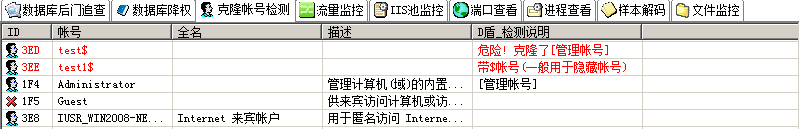

## 第1篇：window入侵排查

### 0x00 前言

当企业发生黑客入侵、系统崩溃或其它影响业务正常运行的安全事件时，急需第一时间进行处理，使企业的网络信息系统在最短时间内恢复正常工作，进一步查找入侵来源，还原入侵事故过程，同时给出解决方案与防范措施，为企业挽回或减少经济损失。  

常见的应急响应事件分类：

web入侵：网页挂马、主页篡改、Webshell

系统入侵：病毒木马、勒索软件、远控后门

网络攻击：DDOS攻击、DNS劫持、ARP欺骗

针对常见的攻击事件，结合工作中应急响应事件分析和解决的方法，总结了一些Window服务器入侵排查的思路。

### 0x01 入侵排查思路

#### 1.1 检查系统账号安全

1、查看服务器是否有弱口令，远程管理端口是否对公网开放。

* 检查方法：据实际情况咨询相关服务器管理员。

2、查看服务器是否存在可疑账号、新增账号。

* 检查方法：打开 cmd 窗口，输入`lusrmgr.msc`命令，查看是否有新增/可疑的账号，如有管理员群组的（Administrators）里的新增账户，如有，请立即禁用或删除掉。 

3、查看服务器是否存在隐藏账号、克隆账号。

* 检查方法：

  a、打开注册表 ，查看管理员对应键值。

  b、使用D盾_web查杀工具，集成了对克隆账号检测的功能。

4、结合日志，查看管理员登录时间、用户名是否存在异常。

* 检查方法：

  a、Win+R打开运行，输入“eventvwr.msc”，回车运行，打开“事件查看器”。

  b、导出Windows日志--安全，利用Log Parser进行分析。

#### 1.2 检查异常端口、进程

1、检查端口连接情况，是否有远程连接、可疑连接。

* 检查方法：

  a、netstat -ano 查看目前的网络连接，定位可疑的ESTABLISHED 

  b、根据netstat 定位出的pid，再通过tasklist命令进行进程定位 tasklist  | findstr “PID”

2、进程

* 检查方法：

  a、开始--运行--输入msinfo32，依次点击“软件环境→正在运行任务”就可以查看到进程的详细信息，比如进程路径、进程ID、文件创建日期、启动时间等。

  b、打开D盾_web查杀工具，进程查看，关注没有签名信息的进程。

  c、通过微软官方提供的 Process Explorer 等工具进行排查 。

  d、查看可疑的进程及其子进程。可以通过观察以下内容：

		    没有签名验证信息的进程
		    没有描述信息的进程
		    进程的属主
		    进程的路径是否合法
		    CPU或内存资源占用长时间过高的进程

3、小技巧：

​	a、查看端口对应的PID： netstat -ano | findstr “port”

​	b、查看进程对应的PID：任务管理器--查看--选择列--PID 或者  tasklist  | findstr “PID”

​	c、查看进程对应的程序位置：

​		任务管理器--选择对应进程--右键打开文件位置

​		运行输入 wmic，cmd界面 输入  process

​	d、tasklist /svc   进程--PID--服务

​	e、查看Windows服务所对应的端口：
​		%system%/system32/drivers/etc/services（一般%system%就是C:\Windows）

#### 1.3 检查启动项、计划任务、服务

1、检查服务器是否有异常的启动项。

* 检查方法：

  a、登录服务器，单击【开始】>【所有程序】>【启动】，默认情况下此目录在是一个空目录，确认是否有非业务程序在该目录下。
  b、单击开始菜单 >【运行】，输入 msconfig，查看是否存在命名异常的启动项目，是则取消勾选命名异常的启动项目，并到命令中显示的路径删除文件。
  c、单击【开始】>【运行】，输入 regedit，打开注册表，查看开机启动项是否正常，特别注意如下三个注册表项：
  HKEY_CURRENT_USER\software\micorsoft\windows\currentversion\run
  HKEY_LOCAL_MACHINE\Software\Microsoft\Windows\CurrentVersion\Run
  HKEY_LOCAL_MACHINE\Software\Microsoft\Windows\CurrentVersion\Runonce
  检查右侧是否有启动异常的项目，如有请删除，并建议安装杀毒软件进行病毒查杀，清除残留病毒或木马。

  d、利用安全软件查看启动项、开机时间管理等。

  e、组策略，运行gpedit.msc。

2、检查计划任务

* 检查方法：

  a、单击【开始】>【设置】>【控制面板】>【任务计划】，查看计划任务属性，便可以发现木马文件的路径。

  b、单击【开始】>【运行】；输入 cmd，然后输入at，检查计算机与网络上的其它计算机之间的会话或计划任务，如有，则确认是否为正常连接。

3、服务自启动

* 检查方法：单击【开始】>【运行】，输入services.msc，注意服务状态和启动类型，检查是否有异常服务。

#### 1.4 检查系统相关信息

1、查看系统版本以及补丁信息

* 检查方法：单击【开始】>【运行】，输入systeminfo，查看系统信息

2、查找可疑目录及文件

* 检查方法：

  a、 查看用户目录，新建账号会在这个目录生成一个用户目录，查看是否有新建用户目录。

  ​	Window 2003  C:\Documents and Settings

  ​	Window 2008R2  C:\Users\

  b、单击【开始】>【运行】，输入%UserProfile%\Recent，分析最近打开分析可疑文件。

  c、在服务器各个目录，可根据文件夹内文件列表时间进行排序，查找可疑文件。

  d、回收站、浏览器下载目录、浏览器历史记录

  e、修改时间在创建时间之前的为可疑文件

3、得到发现WEBSHELL、远控木马的创建时间，如何找出同一时间范围内创建的文件？

​	a、利用 Registry Workshop  注册表编辑器的搜索功能，可以找到最后写入时间区间的文件。

​	b、利用计算机自带文件搜索功能，指定修改时间进行搜索。

#### 1.5 自动化查杀

* 病毒查杀

  * 检查方法：下载安全软件，更新最新病毒库，进行全盘扫描。

* webshell查杀

  * 检查方法：选择具体站点路径进行webshell查杀，建议使用两款webshell查杀工具同时查杀，可相互补充规则库的不足。

#### 1.6 日志分析

系统日志

* 分析方法：

  a、前提：开启审核策略，若日后系统出现故障、安全事故则可以查看系统的日志文件，排除故障，追查入侵者的信息等。

  b、Win+R打开运行，输入“eventvwr.msc”，回车运行，打开“事件查看器”。

  C、导出应用程序日志、安全日志、系统日志，利用Log Parser进行分析。

WEB访问日志

* 分析方法：

  a、找到中间件的web日志，打包到本地方便进行分析。

  b、推荐工具：Window下，推荐用 EmEditor 进行日志分析，支持大文本，搜索效率还不错。

  ​		         Linux下，使用Shell命令组合查询分析

  

### 0x02 工具篇

#### 2.1 病毒分析 

PCHunter：http://www.xuetr.com

火绒剑：https://www.huorong.cn

Process Explorer：https://docs.microsoft.com/zh-cn/sysinternals/downloads/process-explorer

processhacker：https://processhacker.sourceforge.io/downloads.php

autoruns：https://docs.microsoft.com/en-us/sysinternals/downloads/autoruns

OTL：https://www.bleepingcomputer.com/download/otl/

SysInspector：http://download.eset.com.cn/download/detail/?product=sysinspector

#### 2.2 病毒查杀

卡巴斯基：http://devbuilds.kaspersky-labs.com/devbuilds/KVRT/latest/full/KVRT.exe   （推荐理由：绿色版、最新病毒库）

大蜘蛛：http://free.drweb.ru/download+cureit+free（推荐理由：扫描快、一次下载只能用1周，更新病毒库）

火绒安全软件：https://www.huorong.cn

360杀毒：http://sd.360.cn/download_center.html

#### 2.3 病毒动态

CVERC-国家计算机病毒应急处理中心：http://www.cverc.org.cn

微步在线威胁情报社区：https://x.threatbook.cn

火绒安全论坛：http://bbs.huorong.cn/forum-59-1.html

爱毒霸社区：http://bbs.duba.net

腾讯电脑管家：http://bbs.guanjia.qq.com/forum-2-1.html

#### 2.4 在线病毒扫描网站

http://www.virscan.org         //多引擎在线病毒扫描网 v1.02，当前支持 41 款杀毒引擎     

https://habo.qq.com             //腾讯哈勃分析系统

https://virusscan.jotti.org      //Jotti恶意软件扫描系统

http://www.scanvir.com        //针对计算机病毒、手机病毒、可疑文件等进行检测分析

#### 2.5 webshell查杀

D盾_Web查杀：http://www.d99net.net/index.asp

河马webshell查杀：http://www.shellpub.com

深信服Webshell网站后门检测工具：http://edr.sangfor.com.cn/backdoor_detection.html

Safe3：http://www.uusec.com/webshell.zip

