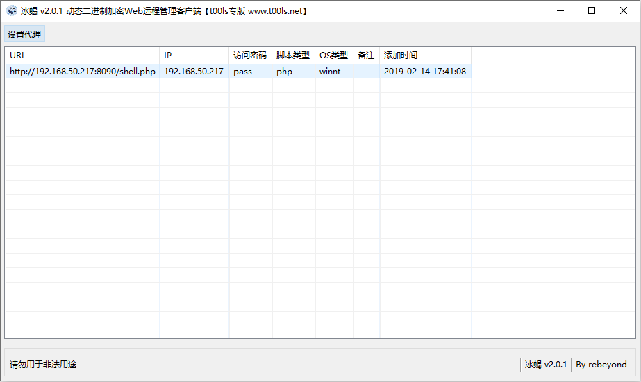

攻击者在入侵网站时，通常要通过各种方式写入Webshell，从而获得服务器的控制权限，比如执行系统命令、读取配置文件、窃取用户数据，篡改网站页面等操作。

本文介绍十款常用的Webshell管理工具，以供你选择，你会选择哪一个？

------

**1、中国菜刀(Chopper)**

中国菜刀是一款专业的网站管理软件，用途广泛，使用方便，小巧实用。只要支持动态脚本的网站，都可以用中国菜刀来进行管理！在非简体中文环境下使用，自动切换到英文界面。UNICODE方式编译，支持多国语言输入显示。


**2、蚁剑(AntSword)**

AntSword是一个开放源代码，跨平台的网站管理工具，旨在满足渗透测试人员以及具有权限和/或授权的安全研究人员以及网站管理员的需求。

github项目地址：https://github.com/AntSwordProject/antSword


**3、C刀(Cknife)**

这是一款跨平台的基于配置文件的中国菜刀，把所有操作给予用户来定义。

github项目地址：https://github.com/Chora10/Cknife


**4、冰蝎(Behinder)**

冰蝎”是一款动态二进制加密网站管理客户端。

github地址：https://github.com/rebeyond/Behinder



**5、Xise**

XISE WebShell管理工具。


**6、Altman**

Altman3是一款渗透测试软件，基于.Net4.0开发，依托Eto.Form可以完美运行在Windows、Linux、Mac等多个平台。

github项目地址：https://github.com/keepwn/Altman


**7、Weevely**

Weevely是一种Python编写的webshell管理工具，跨平台，只支持PHP。

github项目地址：<https://github.com/epinna/weevely3>

用法示例：

```
weevely generate <password> <path>
weevely <URL> <password> [cmd]
```

同时，在Kali 2.0 版本下，集成了三款Web后门工具：WebaCoo、weevely、PHP Meterpreter。


**8、QuasiBot**

QuasiBot是一款php编写的webshell管理工具，可以对webshell进行远程批量管理。

github项目地址：<https://github.com/Smaash/quasibot>


**9、Webshell-Sniper**

这是一款基于终端的webshell管理工具，仅支持在类Unix系统上运行。

github项目地址：https://github.com/WangYihang/Webshell-Sniper

用法示例：

```
Usage : 
        python webshell-sniper.py [URL] [METHOD] [AUTH]
Example : 
        python webshell-sniper.py http://127.0.0.1/c.php POST c
```


**10、WebshellManager**

一款用PHP+Mysql写的一句话WEB端管理工具，目前仅支持对PHP的一句话进行操作。

github项目地址：https://github.com/boy-hack/WebshellManager


我在知识星球发起了一个小讨论，也收集到了一些webshell管理工具，如 hatchet、K8飞刀、lanker，欢迎补充。